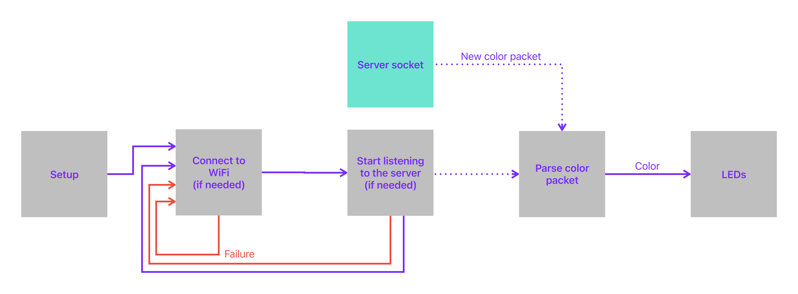

# Client Overview

The client's sole job is to display the colors that are broadcasted by the server. It accomplishes this by connecting to the appropriate network, creating a listener for the packets, parsing packets as they become available, and outputting the colors to the connected LEDs.

## Configuration

The exact configuration of the client may vary from user to user (e.g. different networks, different ESP32 modules).

Non-sensitive configuration occurs in `Configuration.h`. The file is prefilled with values that work for my boards (and hopefully yours too), but you can update it as needed.

Sensitive configuration such as WiFi credentials occcurs in a file that you must create: `Secrets.h`
Please refer to `SecretsTemplate.h` for an example of how to implement.